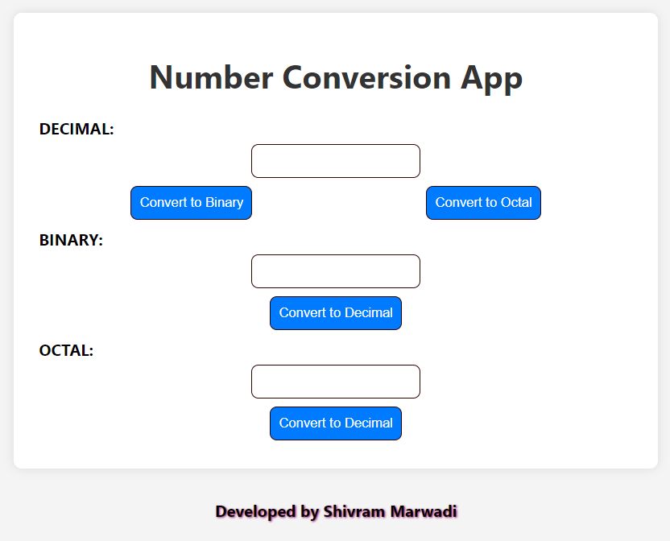

# Number Converter Website


This is a simple web application for converting numbers between different number systems, including decimal, binary, and octal. You can access the live website [here](https://easynumberconverter.netlify.app/).

## Features

- Convert numbers between decimal, binary, and octal.
- User-friendly interface with easy-to-use input fields and buttons.
- Responsive design for seamless use on desktop and mobile devices.

## Technologies Used

- **Frontend**: React.js, HTML, CSS
- **Deployment**: Netlify

## Usage

1. Visit the [website](https://easynumberconverter.netlify.app/).
2. Enter a number in one of the input fields.
3. Click on the corresponding button to convert the number to another number system.

## Local Development

To run this project locally, follow these steps:

1. Clone the repository:

   ```bash
   git clone <REPOSITORY_URL>
